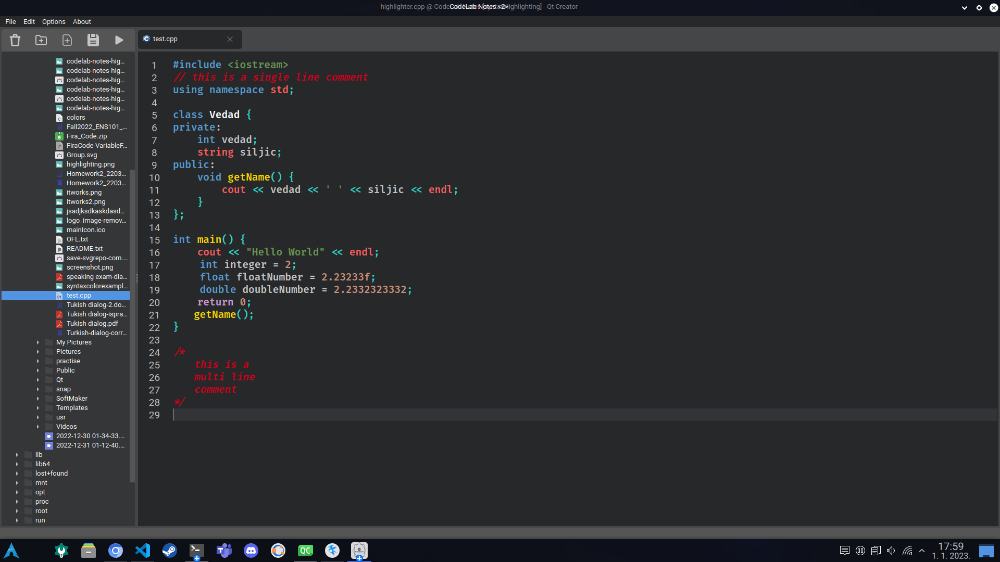

# CodeLab-Notes

## Project Overview 

CodeLab-Notes is a simple code editor that was made in around 13 \~ 15 days.

It was worked on by [Emre Arapcic-Uevak](https://github.com/EmreArapcicUevak) & [Vedad Siljic](https://github.com/VedadSiljic) for their course [CS103](https://ecampus.ius.edu.ba/syllabus/cs103-introduction-programming) graduation project.

The application was made using the [*QT Framework*](https://www.qt.io/).

## The Code Editor

	&nbsp;

CodeLab-Notes can do:
* Multiple File Opening / Saving / Tracking / Modifying / Updating / Removing
* Auto save per tab change
* Different Syntax Highlighting
* Free used memory even on a faulty programm exit (preventing memory leaks)

## How to run the application

### Running without QT Creator

Currenty we only exported the *windows* version to the GitHub, so if you are a MacOS or a Linux user feel free to export your the program on your own using our source code, or get QT Creator and run it on the CMake file. If you are a windows user
all that you have to do is go to the "build" folder and run the executable file provided in the files. You can click [here](https://github.com/EmreArapcicUevak/CodeLab-Notes/tree/readMe/build/windows/x64) to go to the before mentioned folder.

### Running with QT Creator

All you have to do is make sure to get the QT 6.4 or any version higher that is compatible, get CMake and MinGW 64x to be able to compile everything needed, once you are done getting everything ready you can build the [CMake file](https://github.com/EmreArapcicUevak/CodeLab-Notes/blob/readMe/CMakeLists.txt).

## About the creators

The creators of this project as of creating the project are both 1st semester students at [**I**nternational **U**niversity of **S**arajevo](https://www.ius.edu.ba/en).

* Emre Arapcic-Uevak
  * Computer Science Undegraduate
* Vedad Siljic
  * Software Engineering Undergraduate

### Goals for creating this project

When we started creating this project we had close to zero experience with QT. We took this project for the shear reason that it was the only project that was given as an viable option that wasnt a simple console application, and we also never had an chance
to collaborate with anyone else beforehand so this was a good chance to put our *Git* knowledge to the test.

In other words the things we expected to achive by doing this project:
* Learn the C++ QT Framework
* Get a sense of how to work as a team on a "bigger" project.
* Push our C++ and Git knowledge to the test.

### Difficulties we experienced

From everything mentioned above hand the most difficult thing of them all was finding the time to learn QT but also finding the time to work on the project because we were only given a window of around 1 \~ 2 weeks to work on this project due to other subjects
getting in the way of work. We bealive if we have had more time that we could have made CodeLab - Notes even better then what it is.
